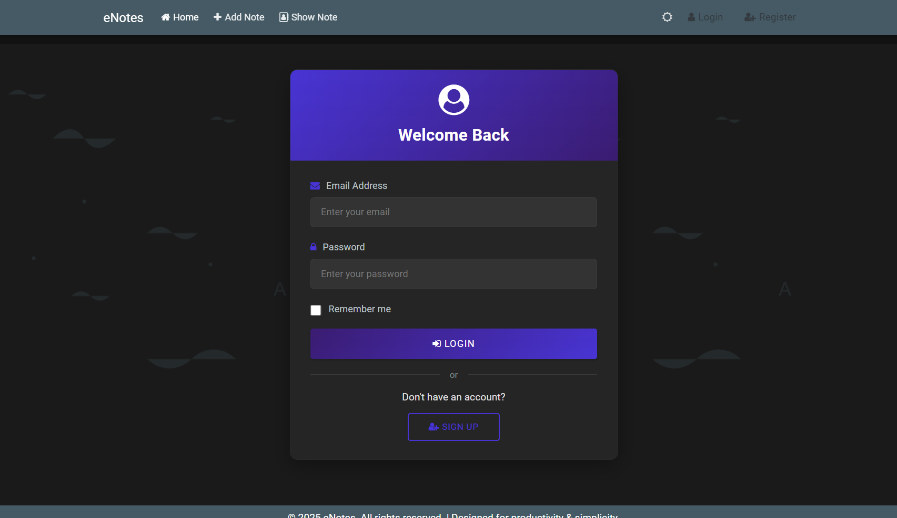

## 📝 eNotes – Smart Notes Taking Web App


### Overview
**eNotes** is a full-stack web app built with Java Servlets, JSP, and MySQL, offering a responsive and maintainable solution for personal note-taking. It emphasizes clean architecture and real-world Java EE development practices.

### Core Features
- Authentication: Secure login & registration with password encryption and session control.
- Note Management: Create, edit, delete, and search notes with support for multiple text fonts, colors, and formatting styles.
- Smart Features: Speech-to-text input, optional geolocation tagging and dark/light mode toggle.
- Responsive UI: Mobile-friendly design with reusable, clean UI components.


### Setup & Configuration
#### Database Setup

Create a MySQL database **similar to the structure defined in `db/schema.sql`**.

You’ll find two main tables:
- `user`: Stores account data
- `post`: Stores note content with tags, timestamps, and optional geolocation

> Make sure to update `DBConnect.java` with your own MySQL credentials:

```java
private static final String URL = "jdbc:mysql://localhost:3306/enotes_db";
private static final String USERNAME = "your_username";
private static final String PASSWORD = "your_password";
```

#### Run the App
Follow these steps to set up and run the eNotes application locally:

1. Clone the Repository
   ```bash
   git clone https://github.com/ravishaa2005/eNotes-Smart-Notes-Taking-Web-App.git
   cd eNotes-Smart-Notes-Taking-Web-App
   ```

2. Open the Project
   Open in Eclipse/IntelliJ as a Dynamic Web Project or Maven Project.

3. Configure the Database
   Start MySQL, import db/schema.sql and update credentials in DBConnect.java).

4. Deploy the Application
   Configure and deploy the project on Apache Tomcat 9.

5. Access in Browser

### App Screenshots
| Landing Page | Login Page | Home Page |
|--------------|------------|-----------|
|  |  |  |

| Add Notes | View/Edit Notes | Light Mode |
|-----------|------------------|------------|
|  |  |  |


  
